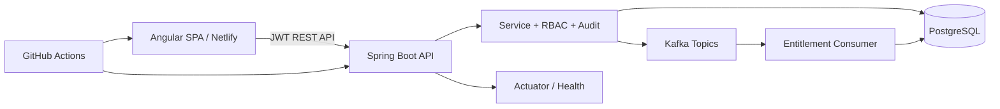

# NEXORA Bank | Commercial Operations

NEXORA is a production-style customer onboarding and entitlement management platform built for commercial banking operations teams. It demonstrates a secure maker/checker workflow from customer onboarding through entitlement approval, event processing, and auditability.

## Architecture



## Highlights

- Premium responsive operations UI with Dashboard, Customer 360, entitlement matrix, approvals, audit timeline, event monitor, and system health.
- JWT-ready Spring Security API with role-based authorization and structured problem responses.
- PostgreSQL/Flyway data model, Kafka event contracts with idempotency tracking, Docker Compose, Netlify config, and CI.

## Local development

```bash
cd frontend
npm install
npm start

cd ../backend
mvn spring-boot:run "-Dspring-boot.run.profiles=dev"
```

The frontend is available at `http://localhost:4200`; API documentation is at `http://localhost:8080/swagger-ui.html`. The `dev` profile uses an in-memory H2 database and disables Kafka publishing/listening, so it is safe to run without local infrastructure. Use Docker Compose for PostgreSQL and Kafka.

## Demo users

| Role | Email | Password |
| --- | --- | --- |
| Relationship Manager | alex.morgan@nexora.demo | Demo@12345 |
| Operations Maker | sam.taylor@nexora.demo | Demo@12345 |
| Approver | jordan.lee@nexora.demo | Demo@12345 |
| Administrator | admin@nexora.demo | Demo@12345 |
| Auditor | audit@nexora.demo | Demo@12345 |

Demo credentials are for local use only. New users are persisted by the backend with BCrypt password hashes. The browser stores only the short-lived JWT access token.

Self-registered users receive the `AUDITOR` role by default and have read-only customer and audit access. Only an administrator should assign operational roles (`RELATIONSHIP_MANAGER`, `OPERATIONS_MAKER`, `APPROVER`, or `ADMIN`) after an appropriate authorization process.

## Docker

```bash
docker compose up --build
```

## Security and operations

- API endpoints are role protected and use a stateless security configuration.
- Customer updates support optimistic locking via `@Version`.
- Every domain event carries an event ID, correlation ID, entity version, and typed payload.
- Consumers persist processed IDs so duplicates are recorded as `DUPLICATE_IGNORED` instead of replayed.
- Consumer failures are persisted independently for operational investigation and retry handling; production deployments should configure the Kafka platform's retry and dead-letter policies.

## Delivery notes

The composition provides local containers for PostgreSQL, Kafka, backend, and frontend. Configure `JWT_SECRET`, `SPRING_DATASOURCE_URL`, and `ALLOWED_ORIGINS` in real environments. See `docker-compose.yml`, `.github/workflows/ci.yml`, and `netlify.toml` for deployment wiring.

### Netlify frontend deployment

Deploy the repository to Netlify with the included `netlify.toml`. In Netlify site settings, set `NEXORA_API_URL` to the public HTTPS address of the deployed Spring Boot API, including `/api/v1` (for example, `https://api.example.com/api/v1`). The build script emits this value into the static runtime config, so no API host is hard-coded in the production bundle. Set the backend `ALLOWED_ORIGINS` to the final Netlify site URL and set a strong managed `JWT_SECRET` before deployment.

### Public backend deployment

`render.yaml` prepares a Docker-based Render web service for the Spring Boot API. Create a managed PostgreSQL database first, then set these Render environment values from its connection details: `SPRING_DATASOURCE_URL` (JDBC URL), `SPRING_DATASOURCE_USERNAME`, and `SPRING_DATASOURCE_PASSWORD`. Set `ALLOWED_ORIGINS` to the Netlify URL, for example `https://your-site.netlify.app`. Render generates `JWT_SECRET`; do not replace it with a value stored in Git. The initial public deployment disables Kafka while preserving the event contract and audit behavior; add a managed Kafka endpoint before enabling `NEXORA_EVENTS_ENABLED`.
